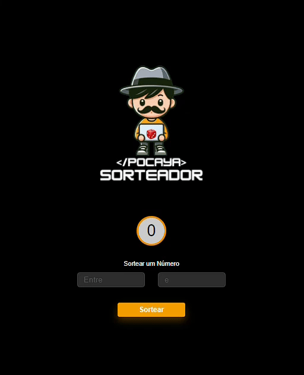

## 🎲 Sorteador de Números 

Este projeto é um sorteador de números desenvolvido como parte do curso Desenvolvedor Full Stack do Dev Club, ministrado pelo professor Rodolfo Mori. Utilizando HTML, CSS e JavaScript, este sorteador permite aos usuários gerar números aleatórios de forma fácil e intuitiva. Através dele, foi possível consolidar os conhecimentos em `Math.random()`.

## 💼 Tecnologias Utilizadas 
- HTML: Utilizado para a estrutura da página web.
- CSS: Responsável pelo estilo e layout do sorteador.
- JavaScript: Implementação da lógica de sorteio de números usando a função `Math.random()`.

## 🚀 Principais Funcionalidades
- Geração instantânea de números aleatórios com um simples clique.
- Interface simples e amigável para uma experiência de usuário agradável.
